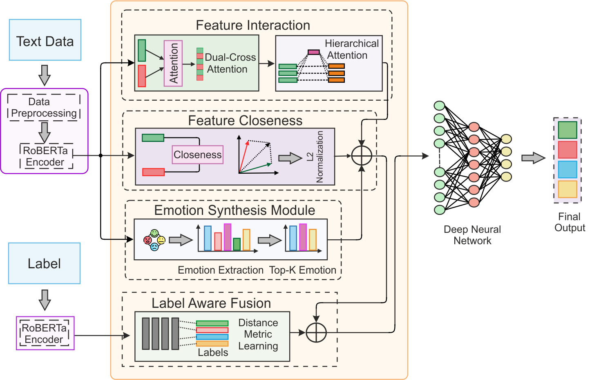

# SPLAENet

**Emotion-aware Dual Cross-Attentive Neural Network with Label Fusion for Stance Detection in Misinformative Social Media Content**

## 📄 Paper Abstract
Our paper proposes a novel approach to stance detection that incorporates emotion-aware dual cross-attention and label-aware fusion mechanisms. This model is designed specifically to handle misinformative content prevalent on social media platforms by leveraging both contextual and emotional signals from user-generated content.

---

## 📚 Datasets Used

We use publicly available benchmark datasets to train and evaluate SPLAENet:

1. **RumourEval 2019 Dataset**  
   [📥 Download here](https://figshare.com/articles/dataset/RumourEval_2019_data/8845580?file=16188500)

2. **SemEval 2016 Dataset**  
   [📥 Download here](https://www.saifmohammad.com/WebPages/StanceDataset.htm)

3. **P-Stance Dataset**  
   [📥 Download from Google Drive](https://drive.google.com/drive/folders/1so8lY1XKpnhUtTvb15edEz6aeHt7CSuh)

---

## 🧠 About the Model

SPLAENet incorporates:
- **Dual Cross-Attention** between source and reply texts.
- **Emotion embeddings** to model affective signals.
- **Label-aware fusion** to enhance representation alignment with stance labels.
- **Distance-based learning** to capture inter-text proximity and stance correlation.

---

## 📌 Citation

(link to be added after publication).
